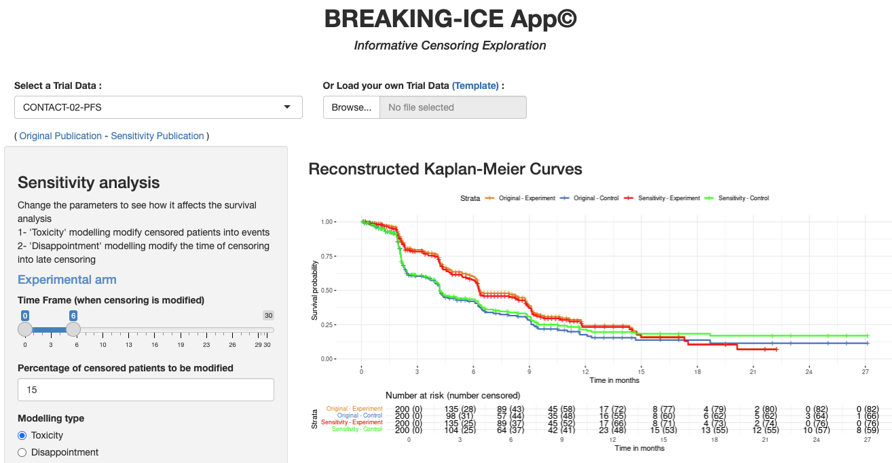

# Breaking-ICE - Informative Censoring Exploration

Welcome to the source code of the Breaking-ICE App© which was created and developped by Timothée Olivier in 2024.



The BREAKING-ICE App© has been published in The Lancet Oncology, June 2025, available [here](https://drive.google.com/file/d/1Oq6lNM__0qMAIMHCRj5D8LtYA8QFcZsb/view?usp=drive_link).

A step-by-step video tutorial is available [here](https://www.timotheeolivier-research.com/breaking-ice-tutorial).


## Installation and Start of the App

To start with the app first clone this directory either in your RStudio or using the following command:
```bash
git clone https://github.com/TimotheeMD/Breaking-ICE
```
Then install the dependencies:
```R
install.packages(c(
  'devtools','bslib','shinydashboard','colourpicker','DT',
  'IPDfromKM','rms','survminer','readxl','forcats'
))
devtools::install_github('rstudio/gridlayout')
```
Then you can start the app in RStudio by opening the `app.R` file and hitting the **Run App** Button
or you can issue in R:
```R
shiny::runApp()
```
With the default you can now access the app at <http://127.0.0.1:5642/>

## Dataset Format

Two data sets are provided as part of this repository as examples: *CONTACT-02-PFS* and *SWOG1801-EFS*.
There is also a template file `www/template.xlsx` that helps to create new datasets -
it is also available direclty in the app to download.

Each Dataset has to be in the `datasets` folder with the naming convention `Trial Data _ <name>.xlsx`.
The following Sheets in the Excel file will be used, some of them are mandatory others optional.
See also the `readCurvesFromExcel` function in [breaking_ice.R](breaking_ice.R)

- **ReadMe** (unused): Documentation of the file
- **Times** (mandatory): 3 columns
  - `trisk`:	time intervals : the time intervals displayed on the Kaplan-Meier plots, often in Months
  - `nrisk.E`:	number of patients at risk in the experimental arm at each time interval : usually displayed below each time interval
  - `nrisk.C`:	number of patients at risk in the control arm at each time interval : similar to nrisk.E but for the control arm
- **EXP** (mandatory): 2 columns
  - `EXP x`:	x values for the experimental arm - obtained via the digitilization of the survival curve
  - `EXP y`:	y values for the experimental arm - obtained via the digitilization of the survival curve
- **CON** (mandatory): 2 columns
  -	`CON x`:	x values for the control arm - obtained via the digitilization of the survival curve
  -	`CON y`:	y values for the control arm - obtained via the digitilization of the survival curve
- **Weblink** (optional): 1 or 2 URLs to publications. If 2, then the first should correspond to the original publication and the second to the sensitivity analysis publication.
- **Sensitivity** (optional): Specify default values for the sensitivity parameters in the UI for this dataset,
  e.g. for `time_frame_max`, `modelling_type`, `percentage`
- **Quality** (optional): Add the quality control values for `HR`, `CI Low`, `CI High`.


## Impressum

Version 1.0 publicly released on 23 November 2024, Current Version 1.3 (released on 07 June 2025)

Project funded by Geneva University Hospital. Technical support provided by [D ONE](https://www.d-one.ai).

The IPDfromKM package was used to reconstruct synthetic individual patient data from digitized curves (Lui et al. BMC Medical Research Methodology. 2021)

© Timothée Olivier, 2024. All rights reserved.
